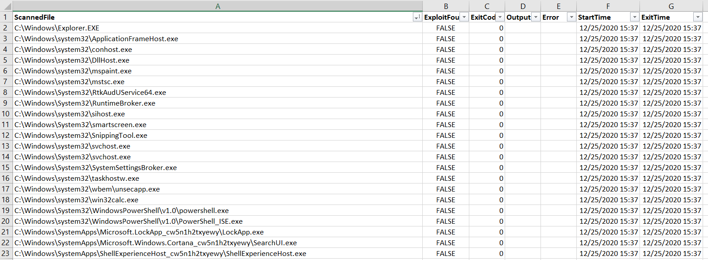

# FireEye Red Team Exploit + Sunburst Exploit Scanner
Powershell script to automate deployment of Yara to scan files for FireEye Exploit and Sunburst Exploit by supplying urls for appropiate Yara rules.

## CREDITS
Credit to VirusTotal for their yara scan tool: 
* https://github.com/VirusTotal/yara

Credit to FireEye for their yara rules files: 
* https://github.com/fireeye/red_team_tool_countermeasures 
* https://github.com/fireeye/sunburst_countermeasures

Credit to Datto and Seagull for inspiration: 
* https://github.com/datto/fireeye-red-team-countermeasure-scanner

## ABOUT
This is a powershell script that can be run locally on any device running Windows OS with Powershell to scan processes or files against supplied download urls of FireEye's Red Team Exploit and Sunburst yara rules. 

It can also be used to match any Yara rules.

Matches may not necessarily mean the file is an actual exploit or that you are at risk. Always ensure you have the latest AV and EDR signatures and that you have proper security measures in place.

The script will log the script actions to a log file specified in the variable **$Script:POpsLogFile**.
The script will gather the results from all files scanned with Yara and output to a csv file located in the folder that is specified in the variable **$Script:DestinationFolder**

The only function you need to specify parameters for is **"Invoke-POpsYaraScan"** function, called at the bottom of the script.

## SCRIPT VARIABLES
The script itself doesn't have any parameters, instead, there are functions within the script that are called with pre-defined parameters. 

You will also need to define **$Script variables** between lines **1040 - 1060**.

If using with an RMM, set up RMM input and output variables to map to the following script variables:

**Input variables** 
* $InScanLevel
* $InFileType

**Output variables**
* $OutExploitFound
* $OutLogFolder

### $InScanLevel (1 | 2 | 3 | 4)
Default should be 1 if using as a RMM monitor.

If you would like to scan entire drive, then run it as an RMM task instead of a monitor to prevent execution timeouts.

* 1: Scans currently running processes - takes about 10 minutes
* 2: Scans home drive 
* 3: Scans all fixed drives
* 4: Scans all accessible drives

### $InFileType (1 | 2)
Default is 1.
* 1: Scan only exe files - default if $InScanLevel = 1
* 2: Scan exe and dll files


## REQUIREMENTS
Yara requires VC++, if yara doesn't run AND VC++ is missing, the script will auto download and install VC++ 2015-2019 bundle and will attempt to download first from Microsoft. You can provide fall back urls for download in the following script variables:
* $Script:POpsVCx64Url = $null
* $Script:POpsVCx86Url = $null

The script has only been tested with Powershell on Windows 7 and up and Windows Server 2008 R2 and up.

You will need to grab the latest Yara64.exe and Yara32.exe from the win zip files hosted here:
https://github.com/VirusTotal/yara/releases/

You will need extract the yara32.exe and yara64.exe from each respective zip.
You will only need these yara files (you do not need the "yarac32.exe" nor "yarac64.exe"):
* yara64.exe
* yara32.exe

Then, host/upload the yara64.exe and yara32.exe files somewhere safe and secure that allows https download. Highly recommend a secure cloud object storage for this. Do not upload to consumer cloud drives as they will limit the amount of traffic and downloads.

Keep note of the download urls for both the yara64.exe, and yara32.exe as you will have to provide the urls as parameter values for the **"Invoke-POpsYaraScan"** function, called at the bottom of the script.

## USAGE
After you have edited the **Invoke-POPsYaraExploitScan.ps1** file with the appropiate script variables and setting the splat parameters at the bottom of the script:

    .\Invoke-POPsYaraExploitScan.ps1

## CSV OUTPUT


## SCRIPT OUTPUT
```  
2020-12-25 15:44:50.254 [VERBOSE]: OS Bitness architecture is [64]
2020-12-25 15:44:50.264 [VERBOSE]: Getting Yara rules
2020-12-25 15:44:50.276 [VERBOSE]: Downloading file from url [https://raw.githubusercontent.com/fireeye/red_team_tool_countermeasures/master/all-yara.yar]
2020-12-25 15:44:50.389 [VERBOSE]: File downloaded successfully to: [C:\Yara_Scanner\yararule_1.yar]
2020-12-25 15:44:50.399 [VERBOSE]: Unblocking file: [C:\Yara_Scanner\yararule_1.yar]
2020-12-25 15:44:50.410 [VERBOSE]: Downloading file from url [https://raw.githubusercontent.com/fireeye/sunburst_countermeasures/main/all-yara.yar]
2020-12-25 15:44:50.515 [VERBOSE]: File downloaded successfully to: [C:\Yara_Scanner\yararule_2.yar]
2020-12-25 15:44:50.525 [VERBOSE]: Unblocking file: [C:\Yara_Scanner\yararule_2.yar]
2020-12-25 15:44:50.536 [VERBOSE]: Scan scope set to [1]
2020-12-25 15:44:50.546 [VERBOSE]: Initializing Yara test run to ensure it can run on this system
2020-12-25 15:44:50.600 [OUTPUT]: 

Output       : 4.0.2
               
Id           : 11276
ArgumentList : {-v}
Error        : 
ProcessName  : 
Name         : 
StartTime    : 12/25/2020 3:44:50 PM
FilePath     : C:\Yara_Scanner\yara64.exe
ExitTime     : 12/25/2020 3:44:50 PM
ExitCode     : 0

2020-12-25 15:44:50.611 [VERBOSE]: Retrieving list of currently running processes
2020-12-25 15:44:51.977 [VERBOSE]: Scanning total of [44] files
2020-12-25 15:44:59.644 [VERBOSE]: No FireEye Red Team exploits found. Review yara log for scan details
2020-12-25 15:44:59.661 [VERBOSE]: Yara scan log exported to: [C:\Yara_Scanner\Logs\SVR-HV01_20201225-154459_yara_scan.csv]
```
